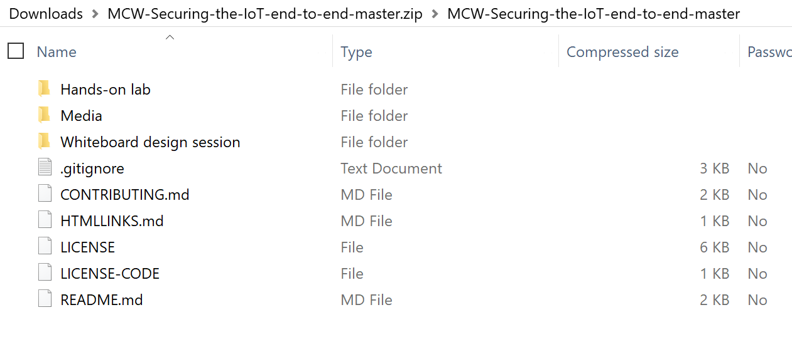
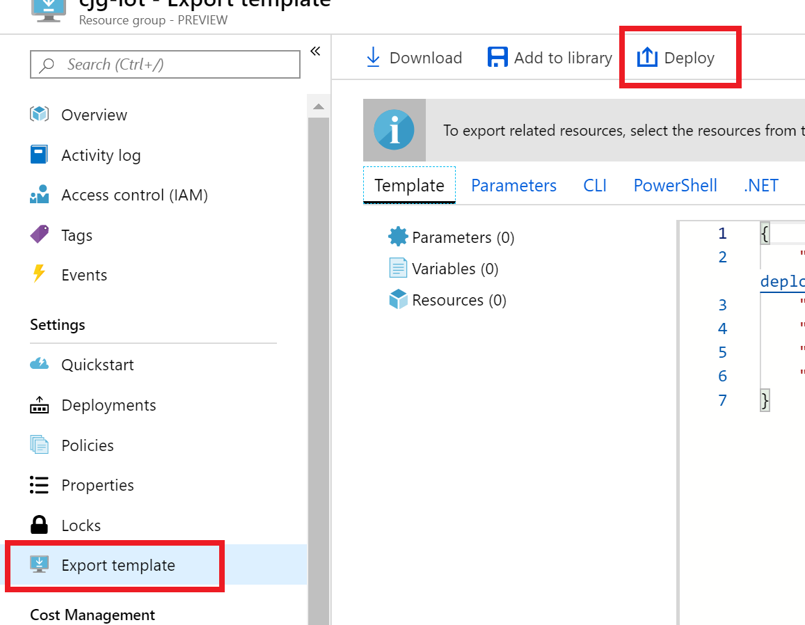
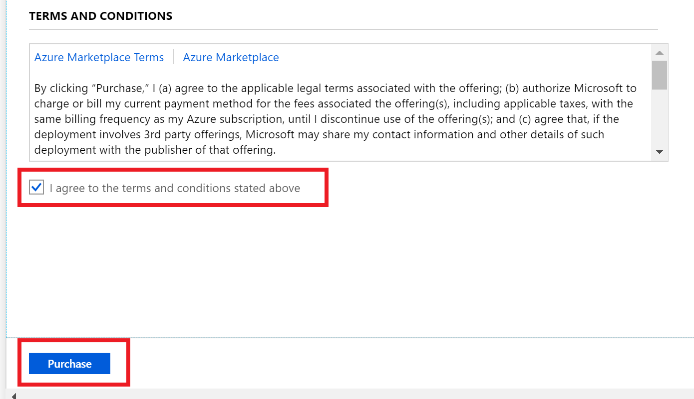

Securing the IoT end-to-end

Before the hands-on lab setup guide

November 2019

Information in this document, including URL and other Internet Web site references, is subject to change without notice. Unless otherwise noted, the example companies, organizations, products, domain names, e-mail addresses, logos, people, places, and events depicted herein are fictitious, and no association with any real company, organization, product, domain name, e-mail address, logo, person, place or event is intended or should be inferred. Complying with all applicable copyright laws is the responsibility of the user. Without limiting the rights under copyright, no part of this document may be reproduced, stored in or introduced into a retrieval system, or transmitted in any form or by any means (electronic, mechanical, photocopying, recording, or otherwise), or for any purpose, without the express written permission of Microsoft Corporation.

Microsoft may have patents, patent applications, trademarks, copyrights, or other intellectual property rights covering subject matter in this document. Except as expressly provided in any written license agreement from Microsoft, the furnishing of this document does not give you any license to these patents, trademarks, copyrights, or other intellectual property.

The names of manufacturers, products, or URLs are provided for informational purposes only and Microsoft makes no representations and warranties, either expressed, implied, or statutory, regarding these manufacturers or the use of the products with any Microsoft technologies. The inclusion of a manufacturer or product does not imply endorsement of Microsoft of the manufacturer or product. Links may be provided to third party sites. Such sites are not under the control of Microsoft and Microsoft is not responsible for the contents of any linked site or any link contained in a linked site, or any changes or updates to such sites. Microsoft is not responsible for webcasting or any other form of transmission received from any linked site. Microsoft is providing these links to you only as a convenience, and the inclusion of any link does not imply endorsement of Microsoft of the site or the products contained therein.

© 2019 Microsoft Corporation. All rights reserved.

Microsoft and the trademarks listed at <https://www.microsoft.com/en-us/legal/intellectualproperty/Trademarks/Usage/General.aspx> are trademarks of the Microsoft group of companies. All other trademarks are property of their respective owners.

**Contents**

<!-- TOC -->

- [Securing the IoT end-to-end before the hands-on lab setup guide](#securing-the-iot-end-to-end-before-the-hands-on-lab-setup-guide)
  - [Requirements](#requirements)
  - [Before the hands-on lab](#before-the-hands-on-lab)
    - [Task 1: Download GitHub resources](#task-1-download-github-resources)
    - [Task 2: Deploy resources to Azure](#task-2-deploy-resources-to-azure)

<!-- /TOC -->

# Securing the IoT end-to-end before the hands-on lab setup guide

## Requirements

1. Microsoft Azure subscription must be pay-as-you-go or MSDN.

    - Trial subscriptions will not work.

## Before the hands-on lab

Duration: 10 minutes

Synopsis: In this exercise, you will set up your environment for use in the rest of the hands-on lab. You should follow all the steps provided in the Before the Hands-on Lab section to prepare your environment *before* attending the workshop.

### Task 1: Download GitHub resources

1. Open a browser window to the cloud workshop GitHub repository (<https://github.com/Microsoft/MCW-Securing-the-IoT-End-to-End>).

2. Select **Clone or download**, then select **Download Zip**.

    

3. Extract the zip file to your local machine, be sure to keep note of where you have extracted the files. You should now see a set of folders:

    

### Task 2: Deploy resources to Azure

1. Open your Azure Portal.

2. Select **Resource groups**.

3. Select **+Add**.

4. Type a resource group name, such as **iotsecurity-\[your initials or first name\]**.

5. Select a **Region**.

    > **Note** Note that some ARM template resources can only be deployed to specific regions.  See the latest available regions for Azure Security Center for IoT [here](https://docs.microsoft.com/en-us/azure/asc-for-iot/service-prerequisites)

6. Select **Review + Create**, then select **Create**.

7. Select **Refresh** to see your new resource group displayed and select it.

8. In the resource group blade, select **Export template**, and then select **Deploy**.

    

9. Select **Build your own template in the editor**.

10. In the extracted folder, open the **\\Hands-on lab\\Resources\\template.json**.

11. Copy and paste it into the window.

12. Select **Save**, you will see the dialog with the input parameters. Fill out the form:

    - Subscription: Select your **subscription**.

    - Resource group: Use an existing Resource group, or create a new one by entering a unique name, such as **iotsecurity-\[your initials or first name\]**.

    - If prompted for location: Select a **location** for the Resource group.

    > **Note** See the latest available regions [here](https://docs.microsoft.com/en-us/azure/asc-for-iot/service-prerequisites).

    - Modify the **alias** to be something unique such as "\[your initials or first name\]".

    - Review the remaining parameters, but if you change anything, be sure to note it for future reference throughout the lab.

    - Check the **I agree to the terms and conditions stated above** checkbox.

    - Select **Purchase**.

    

13. The deployment will take 15-25 minutes to complete. To view the progress, select the **Deployments** link, then select the **Microsoft.Template** deployment.

    - As part of the deployment, you will see the following items created:

       - Azure Data Lake Storage account.

       - Azure Stream Analytics job.

       - App service plan

       - Azure Cosmos DB Account

       - Several virtual machines and supported resources (oilwells-edgevm, oilwells-001, oilwells-002).

       - Event Hubs namespace

       - IoT Hub.

       - IoT Provisioning Service

       - Azure Key Vault

       - Time Series Insights environment

    >**Note**: Not all of these resources may be used in the current version of the hands-on labs.

You should follow all steps provided *before* attending the hands-on lab.
